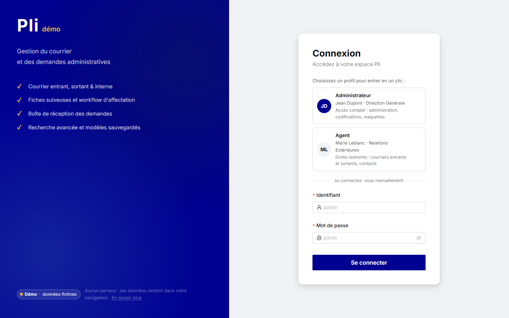
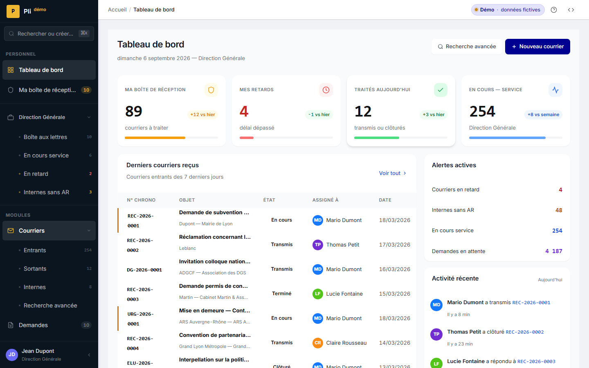
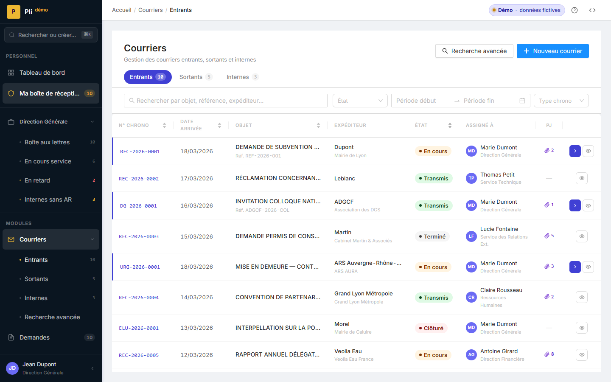
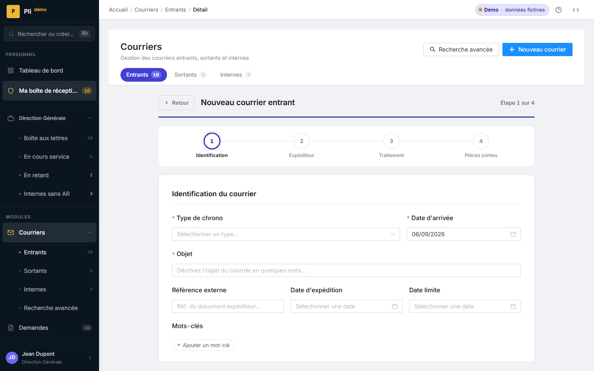
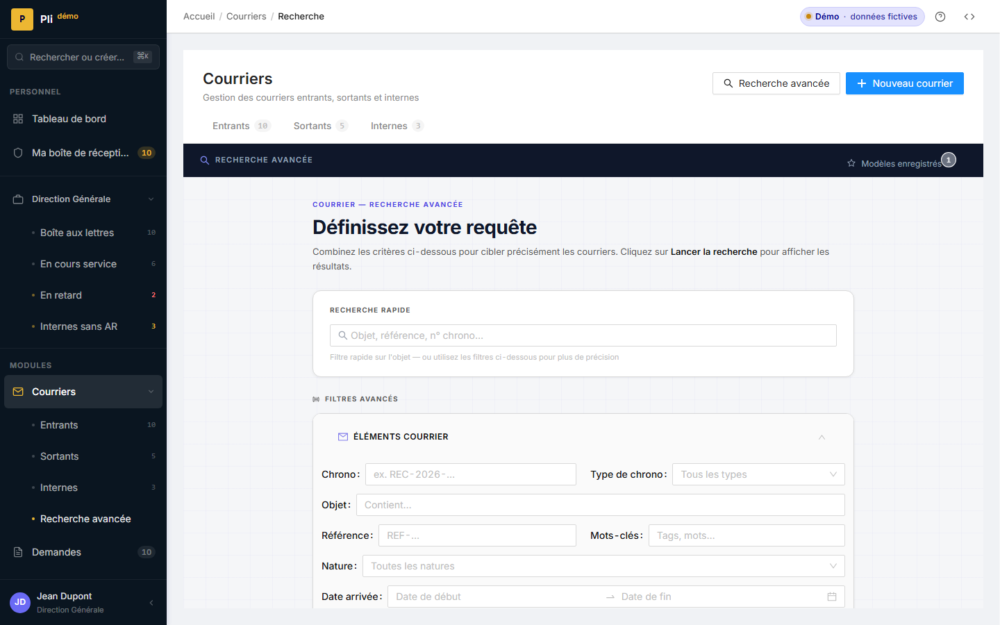
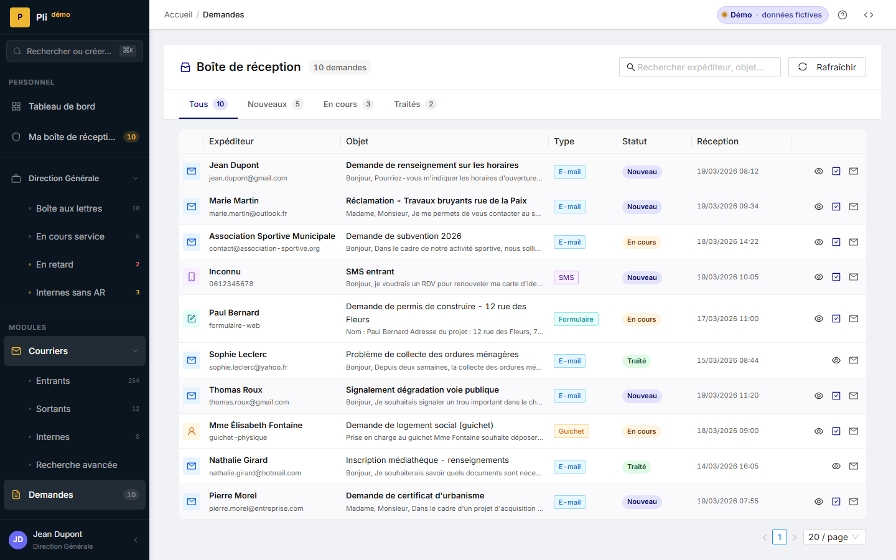
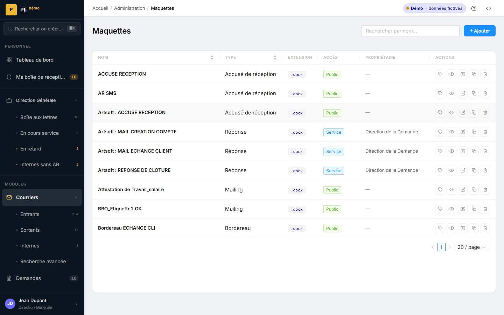
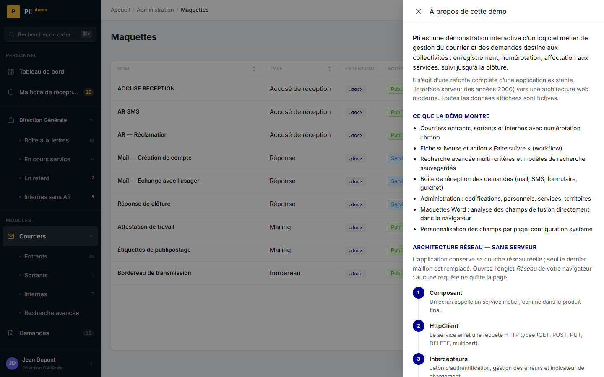

# Pli — Gestion du courrier et des demandes

> Démo interactive d'un logiciel métier moderne pour collectivités, entièrement statique :
> **aucun serveur, aucune base de données, aucune inscription**. Toutes les données sont
> simulées dans votre navigateur.

[](https://github.com/modern-business-app-angular/pli-demo/actions/workflows/ci.yml)
[](https://angular.dev)
[](LICENSE)

**🔗 Démo en ligne : [pli-demo.pages.dev](https://pli-demo.pages.dev)** · miroir GitHub Pages : [modern-business-app-angular.github.io/pli-demo](https://modern-business-app-angular.github.io/pli-demo/)

| Profil | Identifiant | Mot de passe | Droits |
|---|---|---|---|
| Administrateur | `admin` | `admin` | Accès complet : administration, codifications, maquettes |
| Agent | `mleblanc` | `password` | Courriers entrants / sortants, contacts |

_English summary at the bottom of this page._

---

## Le projet

Pli est la refonte d'une application de **gestion du courrier** utilisée par des collectivités
locales : enregistrement des courriers entrants, sortants et internes, numérotation
« chrono », affectation aux services via des **fiches suiveuses**, boîte de réception des
**demandes** citoyennes, recherche avancée, référentiels (codifications), maquettes Word.

L'application d'origine reposait sur une interface serveur des années 2000. Cette démo montre
la cible : une application web moderne, rapide, accessible, pensée pour un usage quotidien
par des agents.

### Ce que la démo montre

- Courriers entrants, sortants et internes, numérotation chrono, pièces jointes
- Fiche suiveuse et action **« Faire suivre »** (workflow d'affectation)
- Recherche avancée multi-critères et **modèles de recherche** sauvegardés
- Boîte de réception des **demandes** (mail, SMS, formulaire, guichet) : traiter, répondre
- Administration : codifications (natures, priorités, services, personnels, territoires…),
  maquettes Word avec **analyse des champs de fusion dans le navigateur**, personnalisation
  des champs par page, configuration système
- Palette de commandes (`Ctrl` + `K`), visite guidée, contrôle d'accès par rôle

## Captures d'écran

| Connexion | Tableau de bord |
|---|---|
|  |  |

| Courriers entrants | Détail d'un courrier |
|---|---|
|  |  |

| Recherche avancée | Demandes |
|---|---|
|  |  |

| Maquettes Word | À propos de la démo |
|---|---|
|  |  |

## Architecture : un réseau simulé dans le navigateur

L'application conserve **sa couche réseau réelle**. Seul le dernier maillon est remplacé :

```
Composant ─▶ Service métier ─▶ HttpClient ─▶ Intercepteurs (auth · erreurs · chargement)
                                                     │
                                                     ▼
                                     MockHttpBackend  (remplace HttpBackend)
                                                     │  Request → getResponse() → Response
                                                     ▼
                                 Handlers MSW (~75 routes, données FR, latence simulée)
                                                     │
                                                     ▼
                                     localStorage (vos modifications persistent)
```

- `src/app/core/mock-network/` — `MockHttpBackend` implémente `HttpBackend` : il convertit la
  `HttpRequest` Angular en `Request` Fetch, la résout avec `getResponse()` de
  [MSW](https://mswjs.io) **sans Service Worker**, puis reconvertit la `Response` en événements
  Angular (`Sent`, `HttpResponse`, `HttpErrorResponse`). Les intercepteurs existants
  (jeton, 401 → déconnexion, indicateur de chargement) fonctionnent à l'identique.
- `src/mocks/handlers/` — les routes de l'API simulée (courriers, demandes, codifications,
  maquettes, recherche…), avec upload multipart, téléchargement de fichiers binaires et
  en-têtes personnalisés.
- `src/mocks/db.ts` — un mini « moteur » de persistance : chaque collection de données est
  restaurée depuis `localStorage` au démarrage et sauvegardée après chaque mutation.
  « Réinitialiser la démo » efface le tout.
- L'origine API est `https://api.pli-demo.invalid` (domaine réservé RFC 2606) : aucune requête
  ne peut quitter la page. Vérifiez dans l'onglet *Réseau* de vos outils de développement.

### Organisation du code

```
src/
├─ app/
│  ├─ core/            config, guards, intercepteurs, mock-network, demo (À propos, visite, personas)
│  ├─ features/        auth · dashboard · courriers · demandes · administration · codifications · search
│  ├─ layout/          shell : sidebar, fil d'Ariane, palette de commandes
│  ├─ shared/          composants transverses
│  └─ state/           stores NgRx Signals (auth, UI)
├─ mocks/              API simulée : handlers MSW, données de démo, persistance
└─ styles/             tokens de design (DSFR « Bleu France »), thème NG-ZORRO (Less), Tailwind
```

## Pile technique

| | |
|---|---|
| Framework | Angular 21 — composants standalone, **zoneless**, signals |
| État | NgRx Signals (SignalStore) |
| UI | NG-ZORRO (Ant Design) — thème Less personnalisé, icônes enregistrées statiquement |
| Styles | Tailwind CSS (préfixe `tw-`), tokens de design inspirés du DSFR |
| API simulée | MSW 2 (handlers HTTP) résolue en mémoire, persistance `localStorage` |
| Qualité | TypeScript strict, ESLint (angular-eslint), Prettier, Vitest |
| Hébergement | Cloudflare Pages — 100 % statique, CDN mondial, aucun démarrage à froid |

## Lancer en local

Prérequis : Node.js 22 (`nvm use` lit le fichier `.nvmrc`).

```bash
npm ci
npm start            # http://localhost:4200
```

```bash
npm run build        # production → dist/pli-demo/browser
npm run preview      # sert le build avec repli SPA → http://localhost:4300
npm run lint         # ESLint (TypeScript + templates)
npm run check:icons  # vérifie que chaque icône utilisée est enregistrée
npm test             # Vitest
npm run screenshots  # régénère docs/screenshots et public/og-image.png (Playwright)
```

Astuce : ajoutez `?latency=0` à l'URL pour désactiver la latence simulée.

## Déploiement (Cloudflare Pages)

1. Connecter le dépôt GitHub dans *Workers & Pages → Create → Pages → Connect to Git*.
2. Paramètres de build :
   - **Build command** : `npm run build`
   - **Build output directory** : `dist/pli-demo/browser`
   - **Variables** : `NODE_VERSION = 22`
3. Le repli SPA est automatique (aucun `404.html` dans la sortie) ; `public/_headers` configure
   le cache immuable des fichiers hachés et quelques en-têtes de sécurité.

La CI GitHub (`.github/workflows/ci.yml`) exécute lint, vérification des icônes, tests et
build à chaque *push* et *pull request*. Un second workflow (`deploy-gh-pages.yml`) publie un
miroir sur GitHub Pages (`npm run build:gh-pages` : base href `/pli-demo/`, `404.html` de repli).

## Limites connues

- Les modules **Protocole** (contacts, organismes, listes de diffusion) et **Profils & droits**
  sont hors périmètre de la démo.
- L'ouverture des maquettes dans Word (WebDAV) est désactivée ; le téléchargement et
  l'analyse des champs de fusion fonctionnent.
- Les modifications sont conservées dans le navigateur courant uniquement.

## Licence

[MIT](LICENSE)

---

## English summary

**Pli** is a portfolio demo of a modern mail & request management application for French
local authorities (incoming/outgoing/internal mail, chrono numbering, routing workflows,
citizen requests inbox, advanced search, reference data, Word templates).

It is a **fully static Angular 21 app**: the real `HttpClient` pipeline is kept, but the
`HttpBackend` is replaced by an in-browser implementation that resolves requests against MSW
request handlers — no Service Worker, no server, no database. Mutations persist in
`localStorage`. Deployed on Cloudflare Pages.

Demo accounts: `admin` / `admin` (administrator), `mleblanc` / `password` (agent).
